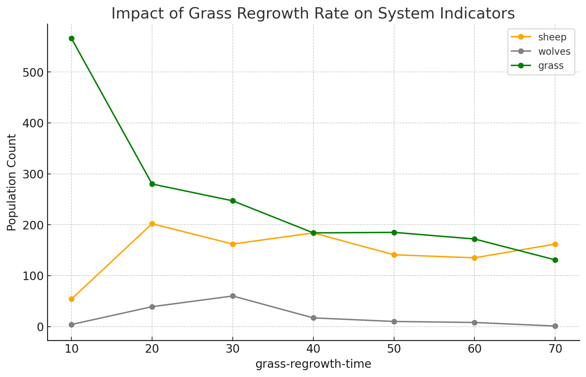

# Комп'ютерні системи імітаційного моделювання
## СПм-23-4, Оцевик Владислав Андрійович
### Лабораторна робота №1. Опис імітаційних моделей та проведення обчислювальних експериментів

### Варіант 7, Wolf Sheep Predation. Модель співіснування хижаків та їх жертв у середовищі NetLogo:
[Wolf Sheep Predation](http://www.netlogoweb.org/launch#http://www.netlogoweb.org/assets/modelslib/Sample%20Models/Biology/Wolf%20Sheep%20Predation.nlogo)

## Вербальний опис моделі:
Дана модель вивчає стабільність екосистеми хижак-жертва. Такі системи вважаються нестабільними, якщо вони призводять до вимирання одного чи кількох видів. Навпаки, стабільна система здатна підтримувати рівновагу популяцій протягом тривалого часу, незважаючи на коливання їх чисельності.

### Існують два основні варіанти цієї моделі:

1. У версії **вівці-вовки** вовки та вівці блукають по ландшафту, при цьому вовки полюють на овець, щоб відновити свою енергію. Кожен рух витрачає енергію вовків, і вони гинуть, коли вичерпують її запаси. Для збереження популяції кожен вовк та вівця мають фіксовану ймовірність розмноження на кожному кроці. Тут трава моделюється як "нескінченна", що дозволяє вівцям завжди мати їжу. Цей варіант моделі демонструє цікаву динаміку популяцій, але в кінцевому підсумку є нестабільним, особливо для взаємодії видів у ресурсно багатому середовищі.

2. У варіанті **вівці-вовки-трава** додатково моделюється трава, яку вівці повинні їсти для підтримання енергії. Після поїдання трави вона відростає з певною затримкою. Поведінка вовків аналогічна першому варіанту, але тепер вівці гинуть, якщо вичерпують енергію. Цей варіант складніший, але загалом стабільний і наближений до класичних моделей Лотки-Вольтерра, хоча агентні моделі краще відображають випадки вимирання.

### Керуючі параметри:
- **model-version** - вибір версії моделі.
- **initial-number-sheep** - початкова кількість овець.
- **initial-number-wolves** - початкова кількість вовків.
- **grass-regrowth-time** - час, необхідний для відростання трави після з’їдання.
- **sheep-gain-from-food** - кількість енергії, яку вівці отримують за кожну з’їдену травинку.
- **wolf-gain-from-food** - енергія, яку вовки отримують за кожну з’їдену вівцю.
- **sheep-reproduce** - ймовірність розмноження вівці на кожному кроці часу.
- **wolf-reproduce** - ймовірність розмноження вовка на кожному кроці часу.

### Параметри візуалізації:
- **show-energy** - показувати енергію кожної тварини як число?

### Показники роботи системи:
- **sheep** - поточна кількість овець.
- **wolves** - поточна кількість вовків.
- **grass** - поточна кількість трави.
- **populations** - графік, що відображає значення **sheep**, **wolves** та **grass**.

### Недоліки моделі:
- Відсутність зграєвої поведінки вовків для оточення овець, як у реальних умовах.
- Випадковий рух овець без спроб втекти від вовків.

### Примітки:
- При стандартних налаштуваннях вовки часто з'їдають більшість овець та гинуть від голоду, що дозволяє вівцям безперешкодно розмножуватися і захоплювати світ. Коли це відбувається, з’являється відповідне повідомлення.
- Модель споживає значні ресурси комп'ютера.

## Обчислювальні експерименти

### 1. Вплив розмноження овець на показники системи
Досліджується залежність чисельності **sheep** та **wolves** від значення **sheep-reproduce** протягом 200 тактів.
Параметри:
- **model-version** - sheep-wolves
- **initial-number-sheep** - 120
- **initial-number-wolves** - 60
- **grass-regrowth-time** - 0
- **sheep-gain-from-food** - 0
- **wolf-gain-from-food** - 25
- **wolf-reproduce** - 6

| sheep-reproduce | sheep | wolves |
|-----------------|-------|--------|
| 1               | 480   | 0      |
| 5               | 0     | 0      |
| 10              | 3550  | 210    |
| 15              | ∞     | ∞      |
| 20              | ∞     | ∞      |

Протягом експерименту при **sheep-reproduce** >10 жоден агент не зник із робочого простору симуляції, що створило значне навантаження на систему.

### 2. Вплив розмноження вовків на показники системи
Досліджується вплив значення **wolf-reproduce** на чисельність **sheep** та **wolves** протягом 200 тактів.
Параметри:
- **model-version** - sheep-wolves
- **initial-number-sheep** - 100
- **initial-number-wolves** - 45
- **grass-regrowth-time** - 0
- **sheep-gain-from-food** - 0
- **wolf-gain-from-food** - 18
- **sheep-reproduce** - 5

| wolf-reproduce | sheep | wolves |
|----------------|-------|--------|
| 1              | 3520  | 48     |
| 5              | 6     | 1      |
| 10             | 20    | 1020   |
| 15             | 50    | 1480   |
| 20             | 58    | 1550   |

Під час експерименту спостерігалася велика різноманітність результатів. За **wolf-reproduce** <10 вовки швидко з'їдали овець, не встигали розмножуватися і вимирали. За вищих значень показник стабілізувався, і жоден агент не зникав.

### 3. Вплив швидкості відростання трави на показники системи
Аналізується вплив **grass-regrowth-time** на чисельність **sheep**, **wolves** та **grass** протягом 200 тактів.
Параметри:
- **model-version** - sheep-wolves
- **initial-number-sheep** - 100
- **initial-number-wolves** - 50
- **sheep-gain-from-food** - 5
- **wolf-gain-from-food** - 22
- **sheep-reproduce** - 4
- **wolf-reproduce** - 5

| grass-regrowth-time | sheep | wolves | grass |
|---------------------|-------|--------|-------|
| 10                  | 60    | 5      | 580   |
| 20                  | 210   | 41     | 295   |
| 30                  | 170   | 64     | 260   |
| 40                  | 190   | 20     | 195   |
| 50                  | 145   | 12     | 195   |
| 60                  | 140   | 9      | 180   |
| 70                  | 165   | 2      | 135   |

У ході експерименту було встановлено, що будь-яке значення **grass-regrowth-time**, відмінне від 0, має незначний вплив на симуляцію.
